## Part2

### Problem1
```
# solution.sql ( /home/training/problem1 )

mkdir problem1
```
```
-- solution.sql

use problem1;

select a.id as id,
       a.type as type,
       a.status as status,
       a.amount as amount,
       round(a.amount - b.average,2) as difference
from account a,
     (select type, avg(amount) as average from account group by type) b
where a.status='Active'
and a.type = b.type
;
```
```
# 수행 결과 확인

hive -f ./solution.sql ( /home/training/problem1 )

A100000	Basic Checking	Active	44539	-7402.48
A100002	Basic Checking	Active	11483	-40458.48
A100013	Basic Checking	Active	45654	-6287.48
A100016	Basic Checking	Active	639	-51302.48
A100018	Basic Checking	Active	63563	11621.52
A100019	Basic Checking	Active	79771	27829.52
A100020	Basic Checking	Active	34328	-17613.48
...(중략)

```
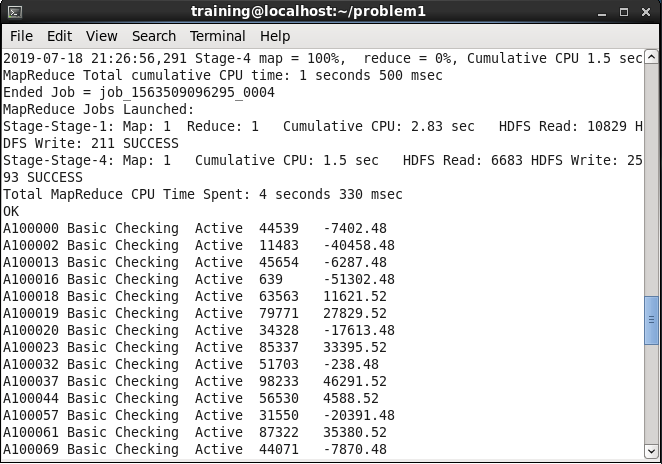

### Problem2
```
create database if not exists problem2;
use problem2;
```
```
# 테이블 생성

create external table if not exists solution(
  id int,
  fname string,
  lname string,
  address string,
  city string,
  state string,
  zip string,
  birthday string,
  hireday string
  )
  row format delimited fields terminated by '\t'
  stored as parquet location "/user/hive/warehouse/employee"

dfs -cp /user/training/problem2/data/employee/*.parquet /user/hive/warehouse/employee/
```
```
# 데이터 확인

select * from solution limit 3;

10000	Rigel	Shaw	Ap #124-4664 Vulputate, Rd.	Cannole	OH	83380	07/12/80	05/30/18
10001	Chancellor	Bond	Ap #702-9298 Pretium Street	Piana degli Albanesi	AZ	38128	03/02/95	04/12/18
10002	Aurora	Franco	5717 Mattis. Street	Casalvieri	CA	12296	01/29/77	07/19/18

```
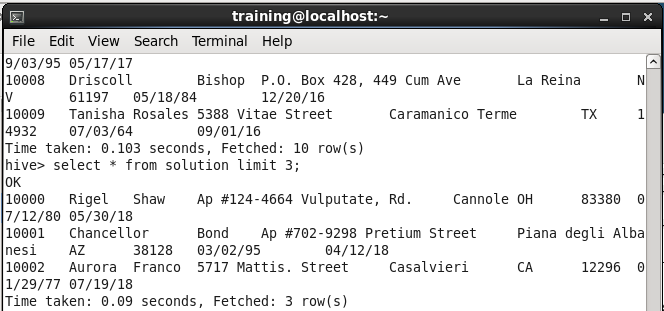

### Problem3
```
use problem3;

create external table if not exists solution(
  id int,
  fname string,
  lname string,
  hphone string
  )
  row format delimited fields terminated by '\t'
  stored as orc location "/user/training/problem3/solution"
```
```
# 데이터 적재

insert into solution
select c.id
, c.fname
, c.lname
, c.hphone
from customer c, account a
where c.id = a.custid
and a.amount < 0;
```
```
# 수행 결과 확인

select * from solution limit 3;

10001	Sybil	Wiley	(504) 780-0366
10010	Brittany	Martinez	(341) 462-0222
10011	Merritt	Roth	(341) 344-3753
```
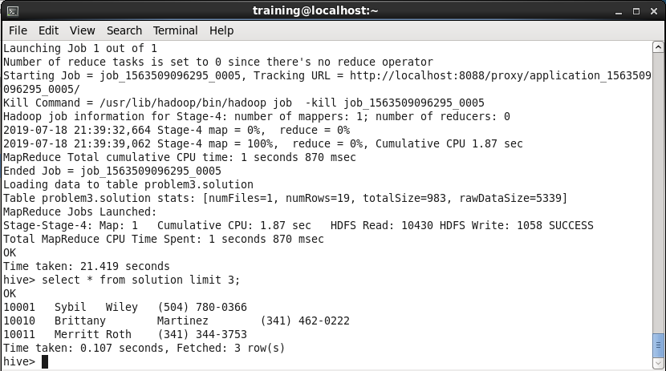

### Problem4
```
create database if not exists problem4;
use problem4;

-- empoyee1 create
create external table if not exists employee1(
  custid int,
  fname string,
  lname string,
  address string,
  city string,
  state string,
  zip string
  )
  row format delimited fields terminated by '\t'
  stored as TEXTFILE location "/user/training/problem4/data/employee1/"
```
```
-- empoyee2 create
create external table if not exists employee2(
  custid int,
  fname string,
  lname string,
  address string,
  city string,
  state string,
  zip string
  )
  row format delimited fields terminated by ','
  stored as TEXTFILE location "/user/training/problem4/data/employee2/"
```
```
-- solution create
  create external table if not exists solution(
    custid int,
    fname string,
    lname string,
    address string,
    city string,
    state string,
    zip string
    )
    row format delimited fields terminated by ','
    stored as TEXTFILE location "/user/training/problem4/solution/"
```
```
# 데이터 적재

insert into solution
select custid
    , fname
    , lname
    , address
    , city
    , state
    , substr(zip, 1, 5)
from employee1
where state = 'CA'
union all
select custid
  , fname
  , lname
  , address
  , city
  , state
  , substr(zip, 1, 5)
from employee2
where state = 'CA'
```
```
# 수행 결과 확인

select * from solution limit 3;

10000063	Burton	Hayes	Ap #720-4012 Vivamus Avenue	San Diego	CA	96066-0000
10000068	Ria	Herman	2974 Cras St.	San Francisco	CA	95310-0000
10000073	Daquan	Roy	7636 Et Rd.	Los Angeles	CA	96606-0000

```
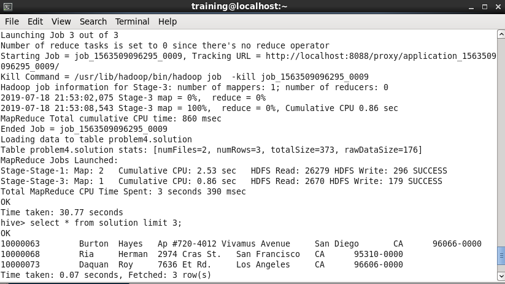


### Problem5
```
# solution.sql ( /home/training/problem5 )

mkdir problem5
```
```
-- solution.sql

use problem5;

select concat_ws(',', c.fname, c.lname, c.city, c.state)
from customer c
where c.city = 'Palo Alto'
and c.state = 'CA'
union all
select concat_ws(',', e.fname, e.lname, e.city, e.state)
from employee e
where e.city = 'Palo Alto'
and e.state = 'CA'
;
```
```
# 수행 결과 확인

hive -f solution.sql

Farrah,Preston,Palo Alto,CA
Brielle,Hudson,Palo Alto,CA
Nelle,Kim,Palo Alto,CA
Tatum,Jacobs,Palo Alto,CA
Ivan,Gentry,Palo Alto,CA
...(중략)

```
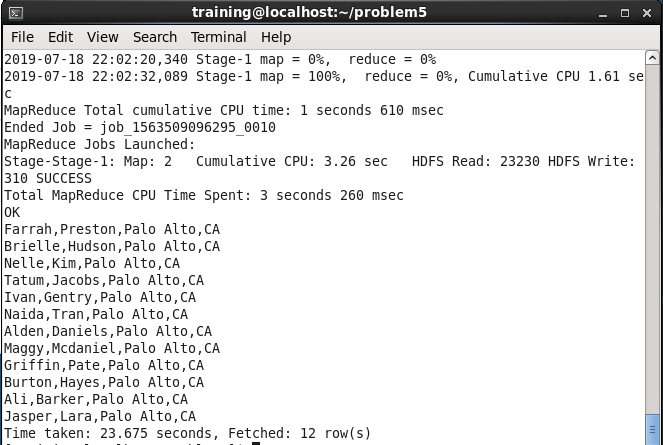

### Problem6
```
use problem6;

-- create solution
create external table if not exists solution(
  id int,
  fname string,
  lname string,
  address string,
  city string,
  state string,
  zip string,
  birthyear string
  )
  row format delimited fields terminated by '\t'
  stored as TEXTFILE location "/user/training/problem6/solution/"
```
```
# 데이터 적재

insert into solution
select id
  , fname
  , lname
  , address
  , city
  , state
  , zip
  , substr(birthday, 7, 4) as birthyear
from employee;
```
```
# 수행 결과 확인

select * from solution limit 3;

10000000	Deanna	Lane	900-1514 Vitae, Rd.	Lafayette	LA	97827	2016
10000001	Hall	Garrett	9656 Urna Avenue	Tucson	AZ	86511	2016
10000002	Lucian	Dotson	P.O. Box 277, 4808 Fusce St.	Kearney	NE	57731	2016
```
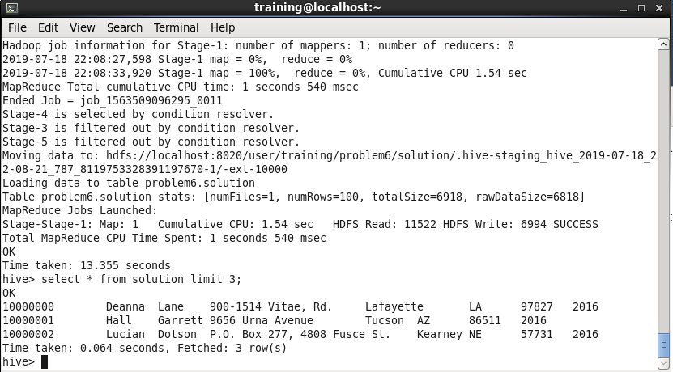

### Problem7
```
# solution.sql ( /home/training/problem7 )
mkdir problem7
```
```
-- solution.sql

use problem7;

select concat(s.lname, ',' , s.fname) as fullname
from (
  select e.*
  from employee e
  where e.city = 'Seattle'
  order by lname, fname
  ) s
;
```
```
# 수행 결과 확인

hive -f solution.sql

Dotson,Lucian
Horn,Zeph
Mcclain,Zeph

```
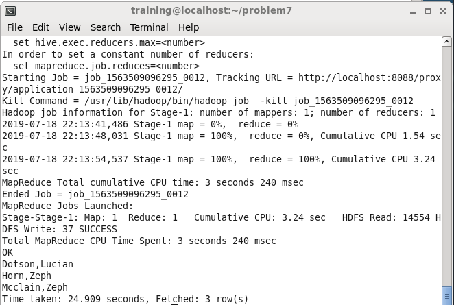

### Problem8
```
# mysql 확인

mysql -u cloudera -p

use problem8;
desc solution;
```
```
# sqoop 수행

sqoop export \
--table solution \
--connect "jdbc:mysql://localhost/problem8" \
--username cloudera \
--password cloudera \
--export-dir "/user/training/problem8/data/customer/" \
--fields-terminated-by "\t" \
--columns "id, fname , lname , address , city, state , zip , birthday";
```
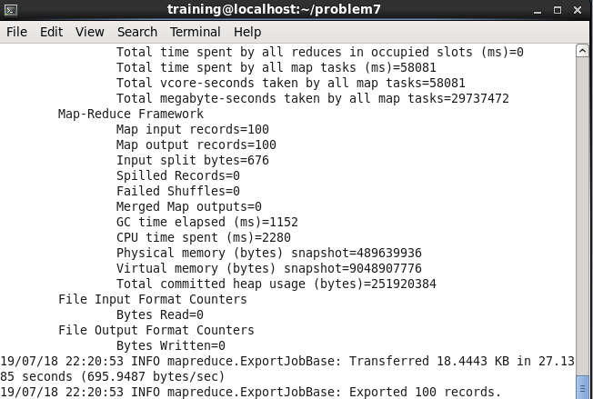
```
# 수행 결과 확인

mysql> select * from solution limit 3;

+----------+--------+---------+------------------------------+-----------+-------+-------+------------+
| id       | fname  | lname   | address                      | city      | state | zip   | birthday   |
+----------+--------+---------+------------------------------+-----------+-------+-------+------------+
| 10000000 | Deanna | Lane    | 900-1514 Vitae, Rd.          | Lafayette | LA    | 97827 | 08/31/2016 |
| 10000001 | Hall   | Garrett | 9656 Urna Avenue             | Tucson    | AZ    | 86511 | 08/24/2016 |
| 10000002 | Lucian | Dotson  | P.O. Box 277, 4808 Fusce St. | Seattle   | WA    | 57731 | 08/12/2016 |
+----------+--------+---------+------------------------------+-----------+-------+-------+------------+

```
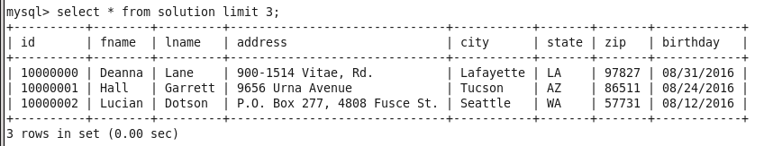

### Problem9
```
use problem9;

create external table if not exists solution(
  id string,
  fname string,
  lname string,
  address string,
  city string,
  state string,
  zip string,
  birthday string
  )
  row format delimited fields terminated by '\t'
  stored as TEXTFILE location "/user/training/problem9/solution/"

```
```
# 데이터 적재

insert into solution
select distinct concat('A', id) as id
, fname
, lname
, address
, city
, state
, zip
, birthday
from customer;
```
```
# 수행 결과 확인

select * from solution limit 3;
```
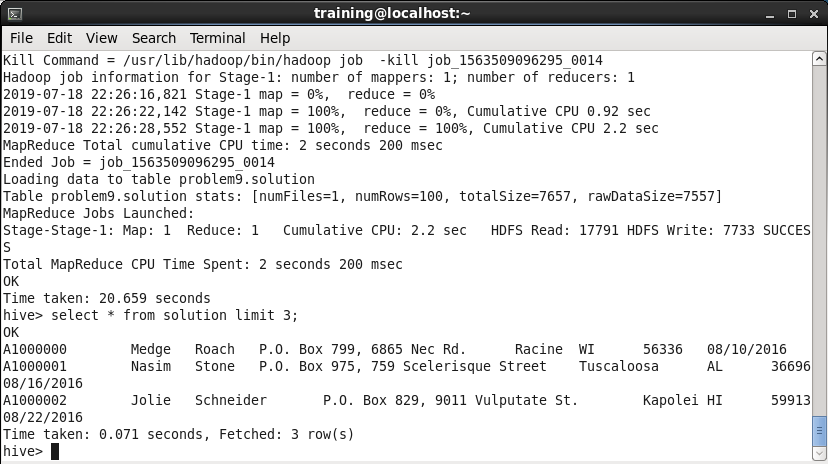

### Problem10
```
use problem10;

# view 생성

create view solution as
select c.id as id
, c.fname as fname
, c.lname as lname
, c.city as city
, c.state as state
, c.zip as zip
, b.charge as charge
, substr(b.tstamp, 0, 10) as billdate
from customer c, billing b
where c.id = b.id
;
```
```
# 수행 결과 확인

select * from solution limit 3;

1000000	Medge	Roach	Racine	WI	56336	15.79	2017-03-05
1000001	Nasim	Stone	Tuscaloosa	AL	36696	57.73	2016-09-05
1000002	Jolie	Schneider	Kapolei	HI	59913	556.04	2017-02-06
```
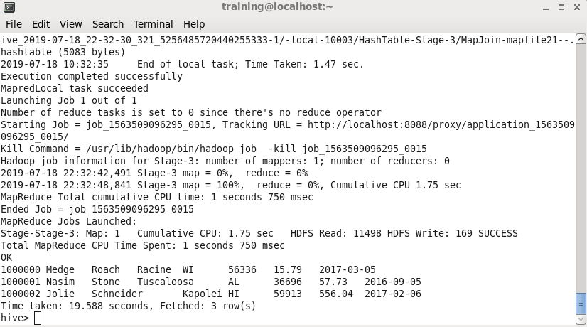

### Problem11
```
mkdir problem11
```
#### a.
```
use default;

select p.name
    , count(*)
  from order_details o,
       products p
 where o.prod_id = p.prod_id
   and p.brand = 'Dualcore'
group by p.name
limit 3
;
```
```
# 수행 결과 확인 (TOP 3)

1.5 TB SATA3 Disk	3956
16 GB Micro SD	3279
2 GB Micro SD	1979
```
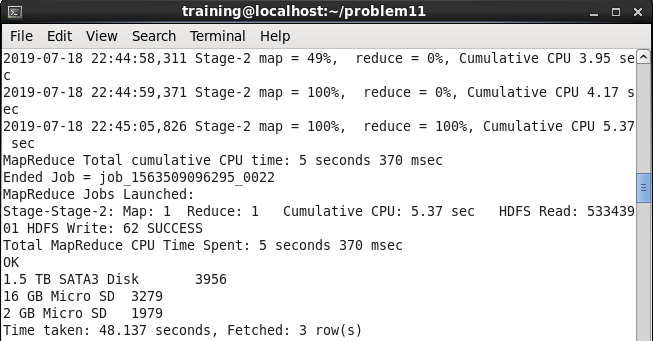

#### b.
```
select to_date(o.order_date),
       sum(p.price) as revenue ,
       sum(p.price - p.cost) as profit
  from orders o,
       order_details d,
       products p
 where o.order_id = d.order_id
   and d.prod_id  = p.prod_id
   and p.brand='Dualcore'
group by to_date(o.order_date);
```
```
# 수행 결과 확인

2008-06-01	170742	14018
2008-06-02	270806	26356
2008-06-03	157680	16130
2008-06-04	84182	9349
2008-06-05	99186	10465
2008-06-06	142582	11095
2008-06-07	217946	25676
...(중략)
```
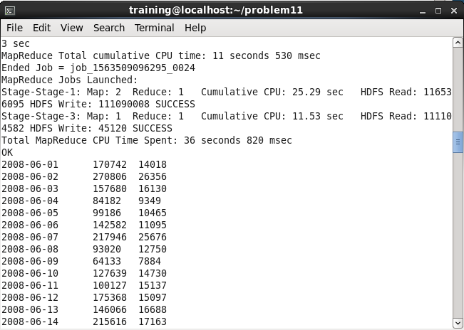

#### c.
```
select o.order_id,
       sum(p.price) as total
  from orders o,
       order_details d,
       products p
 where o.order_id = d.order_id
   and d.prod_id  = p.prod_id
 group by o.order_id
 order by total desc
 limit 10;
```
```
# 수행 결과 확인 (TOP 10)

5605465	940577
5997571	702157
5551963	699348
5944419	627266
5401363	624428
6156005	554497
6293815	554467
5081729	551978
5111703	551007
5353895	549988
```
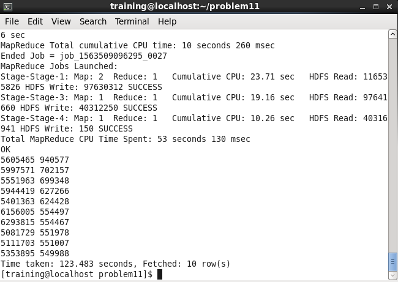

#### 전체 결과 수행
```
# 결과 수행

hive -f solution.sql
```
